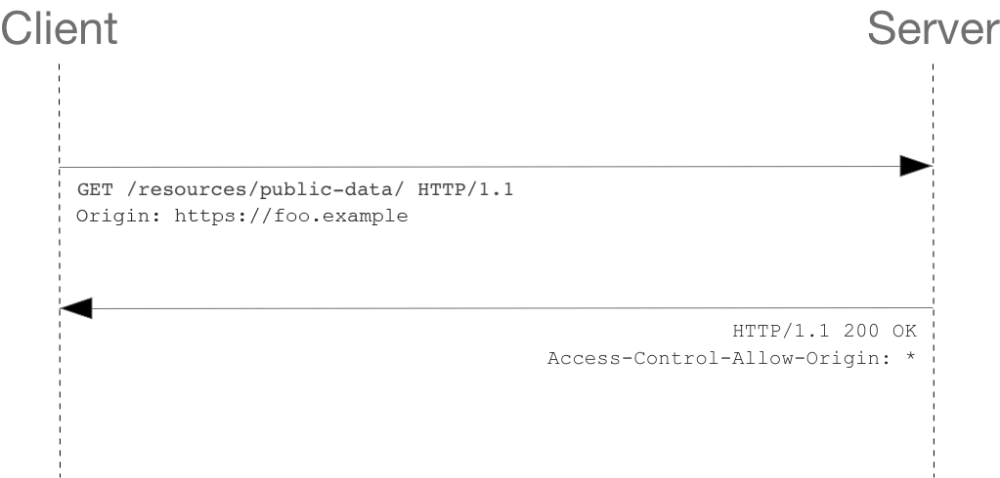
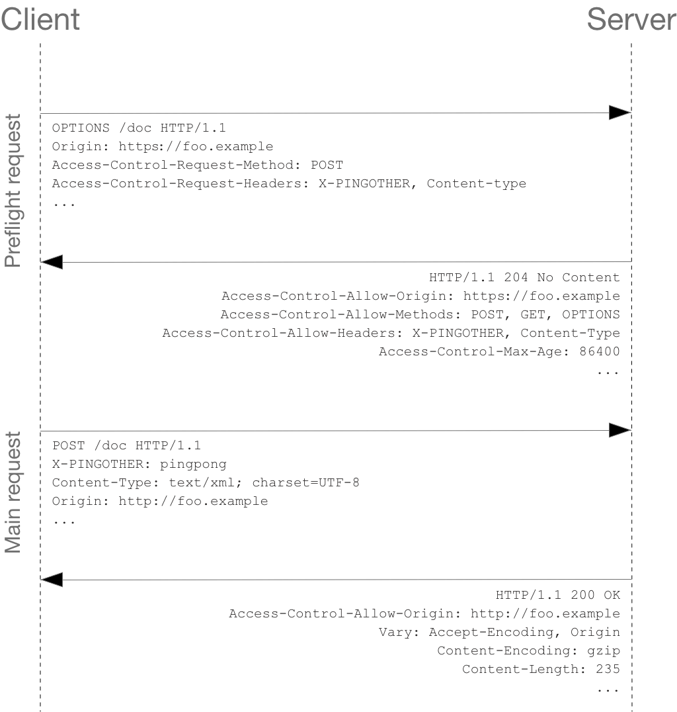

## CORS 的一些总结
### 谁在拦截？
首先，我们常说的跨域，其实就是浏览器的 同源策略 ，我们看一下 MDN 的解释吧：
```
同源策略：同源策略是一个重要的安全策略，它用于限制一个 origin 的文档或者它加载的脚本如何能与另一个源的资源进行交互。它能帮助阻隔恶意文档，减少可能被攻击的媒介。
同源的定义：如果两个 URL 的协议、端口（如果有指定的话）和主机都相同的话，则这两个 URL 是同源的。这个方案也被称为“协议/主机/端口元组”，或者直接是“元组”。（“元组”是指一组项目构成的整体，具有双重/三重/四重/五重等通用形式。）
```
可以看到，这是浏览器的策略，和服务器并没有关系。
另外，服务端就算是想拦截，也没法判断请求是否跨域，HTTP Reqeust 的所有 Header 都是可以被篡改的，它用什么去判断请求是否跨域呢？很明显服务端心有余而力不足。

### 服务端会不会执行？
一般我们遇到跨域的问题，网上的文章都是告诉我们通过 CORS 来解决跨域问题，原理也就是通过浏览器（客户端）会通过服务端返回的一些 header 来判断该请求是否允许跨域：


比如，如上方所示，Access-Control-Allow-Origin 告诉客户端允许请求在哪些 Origin 下被发送，这些 Header 一般都是我们配在 Server 上的。
所以，我们又明确了一件事：请求一定是先发出去，在返回来的时候被浏览器拦截了，如果请求是有返回值的，会被浏览器隐藏掉。


### 预检请求
那请求既然被发出去了，服务端又不会拦截，所以一定会被执行吗？
当然不是，我们再回来把 CORS 这张图放大来看：

我们发现，在发送真正的请求之前，浏览器会先发送一个 Preflight 请求，也就是我们常说的预检请求，它的方法为 OPTIONS。
这也就是为什么有的时候我们明明只发了一个请求，在 Network 里却看到两个。服务端看到的日志：
```
::1 - - [21/Sep/2023:02:44:56 +0000] "OPTIONS /api/v1/article/2 HTTP/1.1" 204 0 "http://127.0.0.1:5173/" "Mozilla/5.0 (Windows NT 10.0; Win64; x64) AppleWebKit/537.36 (KHTML, like Gecko) Chrome/116.0.0.0 Safari/537.36"
```
预检请求有一个很重要的作用就是 询问 服务端是不是允许这次请求，如果当前请求是个跨域的请求，你可以理解为：询问 服务端是不是允许请求在当前域下跨域发送。
当然，它还有其他的作用，比如 询问 服务端支持哪些 HTTP 方法。

### 预检过程
当预检请求到达服务端时，服务端是不会真正执行这个请求的逻辑的，只会在这个请求上返回一些 HTTP Header，以此来告诉客户端是不是要发送真正的请求。
如果服务端告诉客户端，请求是允许被发送的，那真正的请求才会发出去，一般通过如下配置：
```
Access-Control-Allow-Origin: a.com
```

### 简单请求和复杂请求
简单请求和复杂请求
预检请求虽然不会真正在服务端执行逻辑，但也是一个请求，考虑到服务端的开销，不是所有请求都会发送预检的。

一旦浏览器把请求判定为 简单请求，浏览器就不会发送预检了。

浏览器判定请求是否为简单请求要同时满足以下四个条件：

1. 使用下列方法之一：
- GET
- HEAD
- POST
2. 只使用了如下的安全 Header，不得人为设置其他 Header
- Content-Type 的值仅限于下列三者之一：
  - text/plain
  - multipart/form-data
  - application/x-www-form-urlencoded
- Accept
- Accept-Language
- Content-Language
3. 请求中的任意 XMLHttpRequest 对象均没有注册任何事件监听器；XMLHttpRequest 对象可以使用 XMLHttpRequest.upload 属性访问。
4. 请求中没有使用 ReadableStream 对象。
所以，如果你发送的是一个简单请求，这个请求不管是不是会受到跨域的限制，只要发出去了，一定会在服务端被执行，浏览器只是隐藏了返回值而已。

### 总结
简单请求：不管是否跨域，只要发出去了，一定会到达服务端并被执行，浏览器只会隐藏返回值。
复杂请求：先发预检，预检不会真正执行业务逻辑，预检通过后才会发送真正请求并在服务端被执行。
